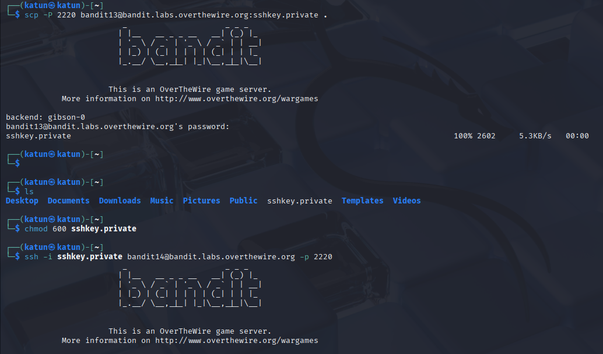

# Bandit Note

## Password
```bash
ssh bandit{}@bandit.labs.overthewire.org -p 2220
```

| User | Password |
|------|----------|
| bandit0 | bandit0 |
| bandit1 | ... |
| bandit2 | ... |
| bandit3 | ... |
| bandit4 | ... |
| bandit5 | 6C7h9GD8M6ai5nr7wo1RonrzFjj9yIrG |
| bandit6 | pXa26xhMWaC2SvDotA4r9EgZkulOeSBW |
| bandit7 | Bmnnvf82KzQlfxgAI2d1zYbr1u9pr3E3 |
| bandit8 | VR1ljMayciFxbnUokuQmJFw6QC9VKtub |
| bandit9 | EjmOSvuAu7sGAHqHVcBDPirRe9T03kxl |
| bandit10 | B0s2khmbT9u0geKuOoVGW3JZKhndE3BG |
| bandit11 | pYfOY6HwUsDj5rL9UvyhU7MCmv8vN5Ro |
| bandit12 | GROozWPO8QyN0mGrjUkID0WCYkZiQxrN |
| bandit13 | qQYQiHOBPR8zR61qxYqX45quvihF2uzk |
| bandit14 | nhập aaWecNkG4FhxJQxz07uiwzVP6bJiYS65 vô `nc localhost 30000` |
| bandit15 | pbLYuZtTg4MgaqfJx8jbA9gKKGqM68A7 |
| bandit16 | kS0Hf0u5HiXFwKMKFqXvPdOTNGGa0X8V |
| bandit17 |  |
| bandit18 | OQxXZjELndr90zuhOTDYBEomI0SZITXI |
| bandit19 | KpsOfPkcP7i1FlIExk2QEjyt6dw8dxZI |
| bandit20 | 4pIjcunZ0fK2vmp3IwfG8Vf7VhxD6pOA |
| bandit21 | bW9kBv5WC3P4yoDyf12LSdGuNz5ka6hY |
| bandit22 |  |
| bandit23 |  |
| bandit24 |  |
| bandit25 |  |
| bandit26 |  |
| bandit27 |  |
| bandit28 |  |
| bandit29 |  |
| bandit30 |  |
| bandit31 |  |
| bandit32 |  |
| bandit33 |  |


## Bandit 4 -> 5
`file /*`
Dùng để xem định dạng file, do hint là *human-readable*. Sẽ ra được file khác vs những files còn lại, do là ASCII text -> human đọc đc -> dùng lệnh `cat`. 

## Bandit 5 -> 6
`find . -size 1033c`
- `.`: current directory
- `-size`: tìm file có kích thước 1033 bytes (có thể dùng `c` để chỉ định đơn vị là bytes) 

Do hint là ***file có kích thước 1033***.

## Bandit 6 -> 7
***Hint:*** 
    - owned by user bandit7
    - owned by group bandit6
    - 33 bytes in size

`find / -user bandit7 -group bandit6 -size 33c`
ra 1 loạt, cái nào được quyền xem thì `cat`

## Bandit 7 -> 8 
Hint là password nằm kế từ `millionth` trong file `data.txt`

`grep -i "millionth" data.txt`

## Bandit 8 -> 9
Hint: The password for the next level is stored in the file data.txt and ***is the only line of text that occurs only once***

`sort data.txt | uniq -u`
- `sort` là để các dòng giống nhau nằm liền kề, do nhỏ uniq nó chỉ so sánh các dòng liền kề.
- `uniq` có option: `-u` để chỉ in ra các dòng xuất hiện đúng một lần.

## Bandit 9 -> 10
Hint: The password for the next level is stored in the file data.txt ***in one of the few human-readable strings, preceded by several ‘=’ characters.***

`strings data.txt | grep "="`

Đại khái đây là file binary (check `file data.txt` sẽ ra là `data`) nên chỉ có 1 dòng là human đọc được. Dùng strings do nó sẽ bỏ qua phần nhị phân và chỉ lấy các chuỗi văn bản.

## Bandit 10 -> 11
hint là base64 --> decode là ra

```bass
echo "VGhlIHBhc3N3b3JkIGlzIHBZZk9ZNkh3VXNEajVyTDlVdnloVTdNQ212OHZONVJvCg" | base64 -d 
```

## Bandit 11 -> 12
where all lowercase (a-z) and uppercase (A-Z) letters have been rotated by 13 positions
Nghĩa là:
- Mỗi chữ cái được dịch đi 13 vị trí trong bảng chữ cái.
- Chữ thường (a-z) chỉ đổi với chữ thường.
- Chữ hoa (A-Z) chỉ đổi với chữ hoa.

Bảng chữ cái: `ABCDEFGHIJKLMNOPQRSTUVWXYZ`
Nếu xoay 13 ký tự: `NOPQRSTUVWXYZABCDEFGHIJKLM`

Dùng lệnh `tr` để thay chữ - chữ 

Lệnh là:
`cat data.txt | tr 'A-Za-z' 'N-ZA-Mn-za-m'`

## Bandit 12 -> 13
 ***hint***: 
 - which is a hexdump of a file => data ko phải file gốc mà là hexdump của file gốc, nên phải biến thành file binary
 - repeatedly compressed. 
 - For this level it may be useful to create a directory under /tmp in which you can work. Use mkdir with a hard to guess directory name. Or better, use the command “mktemp -d”. Then copy the datafile using cp, and rename it using mv (read the manpages!)

`xxd -r data.txt > file` biến về file binary. Sau khi phục hồi thì check `file` ra định dạng `gzip` (hint ý 2) 

```
bandit12@bandit:~$ file /tmp/tmp.qkaJptMyOP/file
/tmp/tmp.qkaJptMyOP/file: gzip compressed data, was "data2.bin", last modified: Wed Jun 24 14:58:58 2026, max compression, from Unix, original size modulo 2^32 578
```

vậy thì giải nén nó thoi, cứ nén ròi dùng `file` xem định dạng rồi nén tiếp

| `file` trả về | Đổi tên | Lệnh xử lý |
|---------------|----------|------------|
| `gzip compressed data` | `mv file file.gz` | `gunzip file.gz` |
| `bzip2 compressed data` | `mv file file.bz2` | `bunzip2 file.bz2` |
| `POSIX tar archive (GNU)` | `mv file file.tar` | `tar -xf file.tar` |
| `ASCII text` | Không cần | `cat file` |

## Bandit 13 -> 14 (SSH Key Authentication)
The password for the next level is stored in /etc/bandit_pass/bandit14 and can only be read by user bandit14

Level này thì không có password, thay vào đó dùng khóa riêng:

`ssh -i sshkey.private bandit14@localhost -p 2220`

Trong đó:
- `-i sshkey.private` → chỉ định private key.
- `bandit14@localhost` → đăng nhập user bandit14.
- `localhost` → máy hiện tại (vì bạn đã SSH vào server Bandit rồi).

https://mayadevbe.me/posts/overthewire/bandit/level14/
Ý tưởng là:

    Lấy private key từ server Bandit về máy của bạn.
    Đổi quyền trên máy bạn (vì trên server bạn không có quyền chmod).
    SSH từ máy bạn vào bandit14.



## Bandit 15 -> 16 
https://mayadevbe.me/posts/overthewire/bandit/level16/

## 16 -> 17
`cat /etc/bandit_pass/bandit16 | openssl s_client -connect localhost:31790 -ign_eof`

## 19 -> 20
`./bandit20-do cat /etc/bandit_pass/bandit20`

## 20 -> 21
Đại khái là phải biến máy mình thành server (dùng `nc`) rồi cho ./subconnect kết nối vào thì nó sẽ nhả password