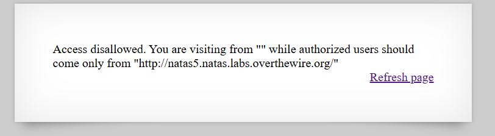
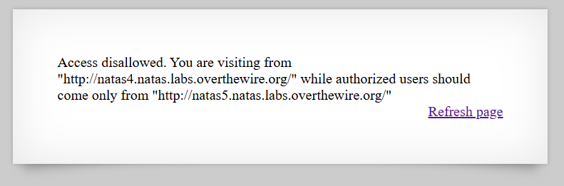
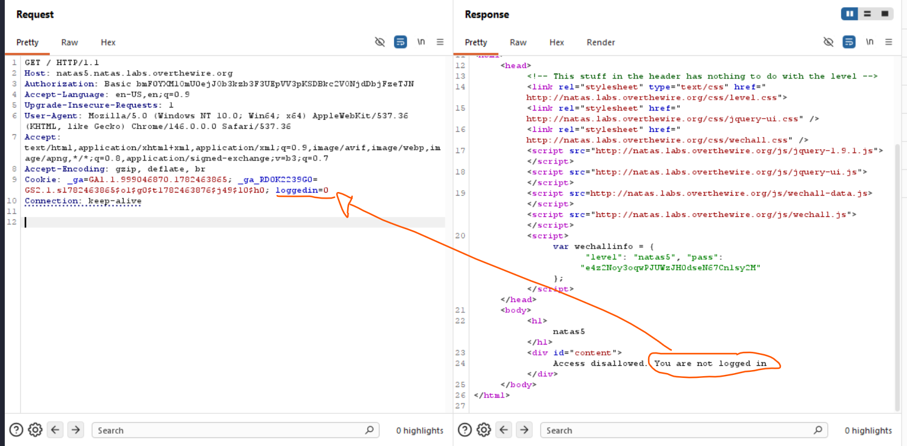
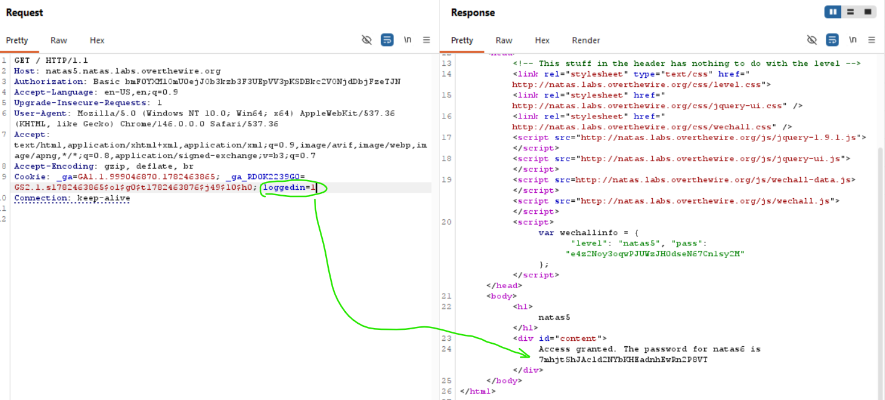
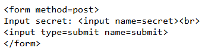
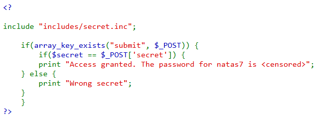
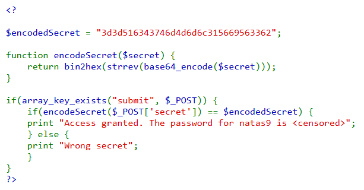

# Natas Notes 
This note is based on the study notes from [Writeups by MayADevBe](https://mayadevbe.me/posts/overthewire/natas)

**Objective**: Learn web security concepts and practice with the Natas wargame.

## Passwords

| User | Password |
|------|----------|
| natas0 | natas0 |
| natas1 | scfWG6qNEIdzqVyfRwEGXyNUfFZkZeQ7 |
| natas2 | vsDOxoXyq3wckCP1ZmTZ71ngIA606odB |
| natas3 | K30JrSRHzjxq3paUQuwozY4MNvmNFyhI |
| natas4 | JDrPnuZAKyl6MkiqQGFIddrqpvgOASth |
| natas5 | e4z2Noy3oqwPJUWzJH0dseN67Cn1sy2M |
| natas6 | 7mhjtShJAcld2NYbKHEadnhEwRn2P8VT |
| natas7 | B1szg95UcTnrzwnF3i3TzYHlyYh8iBV0 |
| natas8 | ugXL95KQmUAJJj6bMezOlBNDyI9Imwkc |
| natas9 | UdxmI27dTaXmnd1rxKQTfws6jihTdcQ9 |


---
# Writeups
## Natas4


Có vẻ là server check "" từ header `Referer`, nên ta có thể (1) dùng `curl` để gửi request với header này. Hoặc (2) đổi `Referer` trong `Developer Tools` của trình duyệt firefox. Hoặc (3) đổi `Referer` trong `Burp Suite`.

```bash
curl "http://natas4.natas.labs.overthewire.org/" --compressed -H "Referer: http://natas5.natas.labs.overthewire.org/" -H "Authorization: Basic ******"
```

- `-H "headername: headervalue"`
- `--compressed` để nén request, tránh bị lỗi 414 Request-URI Too Long.

## Natas5

--> thử đổi thành 1 xem sao



## Natas6

- `<input type=submit name=submit>` là nút submit
- `<input name=secret>` không ghi type thì HTML sẽ hiểu là text --> đây là chỗ nhập input cho biến secret


- Ở đây trong <? ?> là đoạn mã PHP, ở đây có thể thấy POST request sẽ được check với biến `submit`, nếu tồn tại thì nó sẽ đem ``$_POST[`secret`]`` đi so với biến tên là `$secret`.
- Nhưng trong đoạn mã ko có chỗ chứa ***uninitialized/ initialized variable*** nhưng lại có `include "include/secret.inc"` --> khả năng là định nghĩa biến secret ở đây.
- Truy cập `/include/secret.inc`--> thấy biến secret --> nhập vào input --> ra password level tiếp theo

## Natas8

- Nhìn cũng đoán đoán được là, lần này đem biến `secret` đi so nhưng, trước khi so thì nó đi vào hàm `encodeSecret`
- Nên sẽ giải từ "3d3d516343746d4d6d6c315669563362" để xem `$secret` là gì

```bash
echo "3d3d516343746d4d6d6c315669563362" \
| xxd -r -p \
| rev \
| base64 -d
```
-  `echo` là lệnh in ra màn hình
- `\` xuống hàng cho dễ nhìn 
- `|` lấy output của lệnh trước làm input của lệnh sau
- `xxd` Hex dump utility. Có hai chức năng chính: Binary → Hex, Hex → Binary (này thì thim `-r` tức reverse). `-p` plain Nó nói với xxd Input chỉ là chuỗi hex thuần. Ví dụ `414243` không phải `00000000: 4142 43`
- `rev`: là đảo ngược thoi
- `base64 -d`: là lệnh decode base64 tức là từ base64 về lại origional, nếu ko có `-d` thì là encode. 


---
# Theory
## Natas 0, 1 - Web Basics
1. Mỗi website được rendered bởi web browser dựa trên HTML, CSS, JavaScript code được yêu cầu từ server. *Tức là browser gửi HTTP request, server trả về HTML response, browser hiển thị nội dung*. Có thể xem được source bằng 3 cách cơ bản sau:
- Using a command line tool for web requests (such as `curl` or `wget`)
- `Right-clicking` and `selecting ‘View Page Source’` (only HTML)
- Opening the inspector of the developer tools of your chosen browser. (Often done with `F12`)

2. [Hypertext Markup Language (HTML)](https://www.w3schools.com/html/) là xương sống của mọi website. ([xem thêm](/concepts/html.md))

## Natas 2 - Directory Traversal
1. Một ***server*** thực chất là một chiếc máy tính có nhiệm vụ tiếp nhận các requests và gửi lại responses cho client. Một máy chủ web (web server) sẽ gửi các tệp tin được yêu cầu thông qua một đường dẫn URL. 
Thành phần chính của ***URL*** (ví dụ: https://mayadevbe.me/) có thể được coi là địa chỉ của máy chủ, trong khi bất kỳ thành phần nào đi sau nó là vị trí của một tệp tin trên máy chủ đó (ví dụ: https://mayadevbe.me/posts/images/vmbox_setup_wizard_error.png). 
Thông thường, một trang web được cấu hình tốt sẽ cho phép truy cập vào các tệp tin, nhưng không cho phép truy cập vào các thư mục (ví dụ: https://mayadevbe.me/posts/images/), nếu không, tất cả các tệp tin nằm trong thư mục đó sẽ bị lộ và ai cũng có thể truy cập được.

2. Một trang web không chỉ bao gồm một tệp HTML duy nhất. Các trang web hiện đại thường được thiết lập với các tệp HTML, CSS và JS. Thêm vào đó, một máy chủ web có thể lưu trữ các loại tệp khác, chúng có thể được nhúng vào trang web hoặc có thể truy cập độc lập thông qua đường dẫn chính xác. Nếu tệp tin đó được lưu trữ trên cùng một máy chủ, đường dẫn của nó thường sẽ là đường dẫn tương đối và không chứa phần domain chính của URL (ví dụ: /posts/images/vmbox_setup_wizard_error.png).

## Natas 3 - Hidden Files (robots.txt)
1. Internet ngày nay được [indexed](/concepts/crawling-indexing.md) bởi [search-engine crawlers](/concepts/crawling-indexing.md), do đó Google and Co (các đối tác) biết các content tồn tại trên Internet để improve search engine results. *robots.txt* file tồn tại trên các servers để nói với những *crawlers* này và các web bots khác, nhưng phần nào của websites có thể đi vào. Nó cho phép xác định [user-agent]() aka ***quy tắc này nên dành cho con bot cụ thể nào***, và trang nào của website mà user-agent không được phép truy cập ([Example](https://developers.google.com/search/docs/crawling-indexing/robots/create-robots-txt))

```
1 User-agent: Googlebot
2 Disallow: /nogooglebot/
3
4 User-agent: *
5 Allow: /
6
7 Sitemap: https://www.example.com/sitemap.xml
```

Here, for all crawlers/bots the whole website can be visited, except Google’s crawler, which cannot visit the ’nogooglebot’ directory. Also noticeable is the sitemap link. A sitemap is another file to give web crawlers information about the website.

It is important to be aware that the **‘robots.txt’** file does **NOT serve a security purpose**. The disallowed pages can still be visited and might still show up in search engines. 

2. Read more about this file in the (Google Developer Docs)[https://developers.google.com/search/docs/crawling-indexing/robots/create-robots-txt].

## Natas 4

## Natas 5 

## Natas 6 